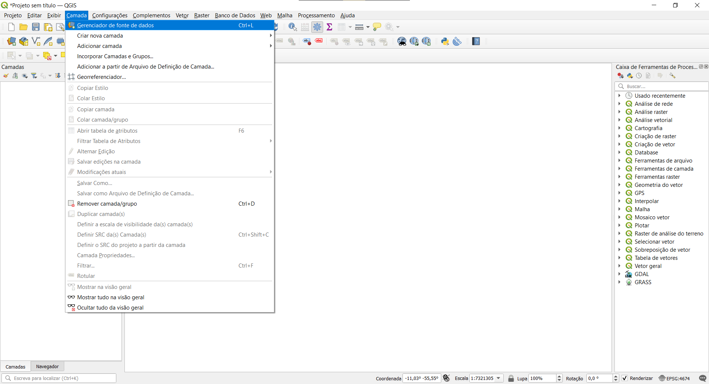
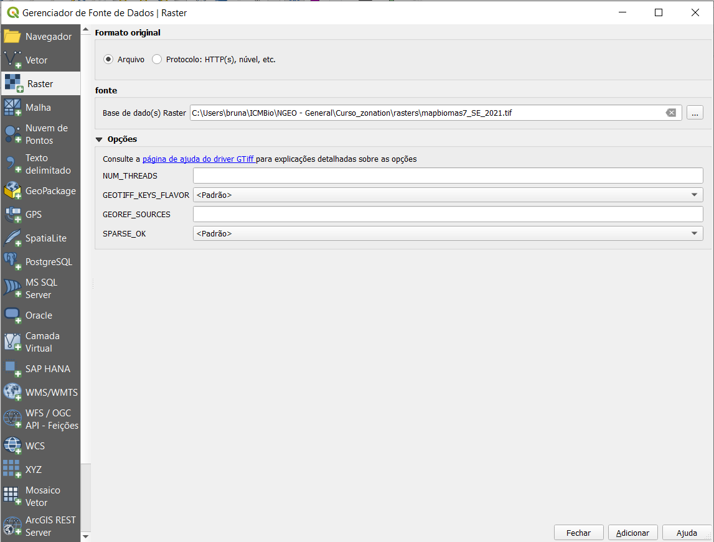

```{r setup, include=FALSE}
knitr::opts_chunk$set(echo = FALSE, 
                      fig.align = "center",
                      dpi = 500,
                      # fig.width = 6.33,
                      # fig.height = 3.43,
                      out.width = '100%'
                      )
```

\newline
> Este tutorial foi criado utilizando o QGIS versão 3.28.5-Firenze. Os nomes dos menus e caminhos serão apresentados em Português. Se desejar trocar o idioma do seu programa, [clique aqui](https://www.youtube.com/watch?v=VK4nC3p-VT4) para saber como.

# Criar arquivo de pontos...

O arquivo pode ter quantas colunas você desejar, mas precisa ter obrigatoriamente, para uso desse tutorial, os pares de coordenadas em graus decimais separados em duas colunas: [**longitude** (`X`) e **latitude** (`Y`)](#latlong). O separador de decimais deve ser ponto.

## ...a partir de um arquivo .csv

1. No menu *Camada*, vá em *Gerenciador de fonte de dados*.

```{r}

```

2. No menu lateral, à esquerda, selecione *Texto delimitado*. Utilizando os os  localizado no final do campo `Nome do arquivo`, localize a tabela no formato `.csv` salva em seu computador. Certifique-se que `Campo X` e `Campo Y` referem-se às colunas de longitude e de latitude respectivamente. 

```{r}

```

<!-- * mostrar amostra de dados na janela -->

3. O arquivo gerado ainda é um arquivo `csv`, porém os programas de SIG são capazes de espacializá-los utilizando as coordenadas geográficas. 

```{r}

```
Para editarmos a tabela de atributos e utilizarmos os pontos em análises espaciais, precisamos transformar em um arquivo vetorial (nesse caso, um *shapefile* - `.shp`).

```{r}

```

## ...a partir de um arquivo .xlsx

1. Para criar um arquivo de pontos a partir de coordenadas em uma planilha `.xlsx`, é necessário instalar um complemento chamado **Spreadsheet Layers**. Pra isso, no menu *Complementos*, vá em *Gerenciar e Instalar Complementos*.

```{r}

```

2.  No campo `Buscar...`, digite o nome do complemento (*Spreadsheet Layers*). Clique sobre ele e, após, clique em `Instalar Complemento`.

```{r}

```

Quando a instalação estiver completa, a mensagem `Complemento instalado corretamente` aprecerá no topo da janela. Feche a janela de complementos.

3. O complemento já está pronto para ser usado no menu `Camada`, `Adicionar camada`, `Add Spreadsheet Layers...`. Porém, vamos adicionar uma barra de ferramentas para facilitar o acesso. 

Clique com o botão esquerdo em qualquer parte fazia da barra de ferramentas, parte cinza onde estão localizados os botões.

<!-- ```{r} -->
<!--  -->
<!-- ``` -->

<!-- c1. adicionar barra de gerenciamento de camadas -->

```{r}
knitr::include_graphics("images/noun-mouse-click-arrow-1676719_2.png")
```

4. Ative o item `Gerenciar camadas`.

```{r}

```

Uma nova barra aparecerá do lado esquerdo. Você pode mover para que fique em qualquer parte da janela.

5. Clique no ícone do complemento `Add Spreadsheet Layer...`.

```{r}
# knitr::include_graphics("images/gerenciar_camadas_2.png")

```

6. Clique em `Browse...`, localizado no final do campo `File Name` e localize a tabela no formato `.xlsx` salva em seu computador. Se houver mais de uma planilha no arquivo, selecione a aba correta no campo `Sheet`. 
Marque a opção `Geometry`. Certifique-se que `X field` e `Y field` correspondem às colunas de longitude e de latitude, respectivamente. Configure, no campo `Reference system`, o sistma de coordenadas **SIRGAS 2000**. (Caso ele não seja selecionado automaticamente, clique no ícone do globo ) e busque o sistema de referencia conforme figura abaixo:

```{r}

```

7. Marque a caixa `Show fields in attribute table` se desejar que as colunas das coordenadas apareçam na tabela de atributos (eu não vejo porque não).

```{r}

```

# Abrir arquivos vetoriais

## Exemplo 1 - Limites estaduais

1. Na barra de ferramentas que adicionamos na seção anterior, clique em `Adicionar Camada Vetorial`.

```{r}
knitr::include_graphics("images/add_shp.png")
```

2. Utilizando os 3 pontinhos  localizado no final do campo `Base(s) de vetores`, localize, na pasta `shapes`, o arquivo `limites_estaduais.shp` salvo em seu computador.

Clique em `Adicionar`.

```{r}

```

## Exemplo 2 - Unidades de conservação

1. Na barra de ferramentas que adicionamos na seção anterior, clique em `Adicionar Camada Vetorial`.

2. Utilizando os 3 pontinhos  localizado no final do campo `Base(s) de vetores`, localize, na pasta `shapes`, o arquivo `UCsFedIcmb_EstMunicMMA_se.shp` salvo em seu computador.

<!-- # Mudar sistema de referencias de coordenadas de um arquivo vetorial -->

<!-- limites_estaduais sirgas2000 para albers -->

# Criar grade de polígonos

Vamos criar uma grade de polígonos quadrados, com 5 km de lado, com a mesma extensão que a área de estudo - nesse caso, a parte continental da região sudeste do Brasil.

1. No menu *Vetor*, vá em *Investigar* e em *Criar grade*.

```{r}
knitr::include_graphics("images/01_criar_grade.png")
```

As células da grade podem ter 3 formatos: retângulo, diamante e hexágono.

```{r, fig.cap="Diferentes formatos de células da grade. [Fonte.](https://docs.qgis.org/3.28/pt_BR/docs/user_manual/processing_algs/qgis/vectorcreation.html#create-grid)"}

knitr::include_graphics("images/grids_types.png")
```

2. No campo `Tipo de grade`, selecione `Retângulo (Polígono)`. No campo `Extensão da grade`, clique no botão contendo 3 pontinhos  e vá em `Calcular a partir da Camada`. Escolha a camada `limites_estaduais`.

```{r}

```

3. Nos campos `Espaçamento horizontal` e `Espaçamento vertical`, insira o valor 5000. Escolha o lugar onde deseja salvar o arquivo e clique em `Executar`.

```{r}

```

Neste momento, podemos adicionar ao *shapefile* criado um **índice espacial**. O índice espacial torna as consultas espaciais muito mais rápidas. Facilitará nosso passo seguinte, em que selecionaremos apenas as células da grade criada que se sobrepõe a área dos estados da região sudeste do Brasil.

4. Clique com o botão direito sobre o nome da camada `grid_5km` e vá em `Propriedades`. Também é possível acessar as propriedades da camada clicando duas vezes sobre seu nome.

```{r}

```

Na barra lateral, clique em *fonte*. Em *Geometry*, clique no botão `Criar Índice Espacial`. Após alguns segundos, dependendo do tamanho do arquivo vetorial e da capacidade computacional, a mensagem `Sucesso na criação do índice espacial` irá aparecer. Clique em `Ok` e `Ok` novamente para fechar a janela das propriedades da camada.

```{r}

```

5. Agora, vamos selecionar as células da grade que se sobrepõe a área dos estados da região sudeste. Clique no botão *Selecionar por localizaçao*.

```{r}

```

6. No campo `Selecionar feições de`, escolha a camada `grade_5km`. Certifique-se de que apenas a opção `interseccionam` esteja marcada e escolha a camada `limites_estaduais` no campo `Ao comparar com as feições do`. Como, nesse momento, não temos uma seleção ativa, selecione `Criar uma nova seleção` no campo `Modificar seleção atual por`. Clique em `executar`. Os polígonos da grade que correspondem ao critério selecionado ficarão **amarelos**.

```{r}

```

7. Clique com o botão direito na camada que selecionamos, `grid_5km`, vá em *Exportar* e em *Salvar Feições selecionadas como...*.

```{r}
knitr::include_graphics("images/02_selecionar_por_localizacao3.png")
```

8. Utilizando os 3 pontinhos  localizado no final do campo `Nome do arquivo`, escolha o local onde deseja salvar o arquivo vetorial contendo a grade resultante da seleção. Certifique-se que a opção `Salvar somente feições selecionadas` esteja marcada. Na opção `Selecione os campos para exportar e as opções de exportação`, selecione as colunas que deseja manter na tabela de atributos. Na figura abaixo, apenas o atributo `id` porque as outras não serão usadas nos passos seguintes, mas essa seleção é opcional.

```{r}
knitr::include_graphics("images/02_selecionar_por_localizacao4.png")
```

# Transformar grade (arquivo vetorial) em arquivo raster

1. No menu *Raster*, vá em *Converter* e em *Converter vetor para raster (rasterizar)*.

```{r}
knitr::include_graphics("images/03_rasterizar_grid.png")
```

2. Em `Camada de entrada`, escolha a camada que desejamos *rasterizar*: `grid_5km_final`. Queremos que todos os *pixels* tenham o mesmo valor (1), mas não temos uma coluna na tabela de atributos que indique isso. Por isso, não colocaremos nada em `Campo a usar para o valor burn-in [opcional]`. Indicaremos o valor `1` em `Um valor fixo para gravar [opcional]`.

3. No campo `Unidades de tamanho da saída`, indique `Unidades georreferenciadas` (correspondente a unidade do sistema de referência da `camada de entrada`. Nesse caso, **metros**.)

4. Em `Resolução Horizontal/Largura` e `Resoluçao Vertical/Altura`, digite o valor equivalente ao lado do quadrado da grade que definimos anteriormente, em **metros**: `5000`.

5. No campo `Extensão de saída`, clique no botão contendo os 3 pontinhos , vá em *Calcular a partir da camada* e indique a grade final como parâmetro (`grid_5km_final`). Clique em `Executar`.

```{r}
knitr::include_graphics("images/03_rasterizar_grid2.png")
```

O *pixel* do *raster* final e a quadrícula da grade que deu origem ao *raster* precisam ter o mesmo tamanho e a mesma posição.

```{r}
knitr::include_graphics("images/raster_final.png")
```

# Ajustar um raster em função do *raster modelo*

Este passo é importante para a criação da variável **Condição da Paisagem**. Vamos usar uma classe do Projeto MapBiomas - coleção 7 para esse passo. 

1. Clique no botão `Adicionar Camada Raster`, localizada na barra de ferramentas `Gerenciar Camadas` que ativamos anteriormente (Também pode ser feito pelo menu *Camada*, *Adicionar Camada*, *Adicionar Camada Raster...*).

```{r}

```
2. Utilize o botão contendo os 3 pontinhos , localizado no final do campo `Base de dado(s) raster` para localizar o dado do MapBiomas no seu computador. Clique em `Adicionar`. Depois, clique em `Fechar`.

```{r}

```

3. Vamos adicionar uma [paleta de cores para as classes de uso e cobertura](https://mapbiomas-br-site.s3.amazonaws.com/downloads/_EN__C%C3%B3digos_da_legenda_Cole%C3%A7%C3%A3o_7.pdf). 
Clique duas vezes sobre o nome da camada para abrir a janela de **Propriedades**. 

```{r}
knitr::include_graphics("images/raster_propriedades.png")
```

4. No menu lateral, clique em *Simbologia*. No campo `Tipo de redenrização`, escolha `Paletizado/Valores únicos.` Clique em `Classificar`.

5. Clique no botão `Estilo`, localizado na parte inferior, a esquerda, da janela e vá em `Carregar Estilo`.

```{r}

```

6. Localize, no seu computador, na mesma pasta em que o dado do MapBiomas está localizado, o arquivo `mapbiomasBR7_simbologia.qml`. Clique em `Ok` para fechar a janela. 

7. Agora, vamos reclassificar o *raster* para ficarmos apenas com as classes correspondentes a **Agropecuária**. 

8. Na *Caixa de Ferramentas de Processamento*, normalmente localizada no lado direito, acesse o menu `GRASS`, depois vá em `Raster (r.*)`, e localize a ferramenta `r.reclass` (ou digite o nome da ferramenta no campo de busca localizado no topo da *Caixa de Ferramentas*).

> Se a sua *Caixa de Ferramentas de Processamento* não estiver visível, é possível ativá-la no menu *Processamento*, *Caixa de ferramentas*. 

```{r}


```

9. No campo `Input raster layer`, selecione a camada com os dados do MapBiomas `mapbiomas7_SE_2021.tif`. No campo `Reclass rules text`, colocamos a regra que queremos usar para a reclassificação do *raster*: todos os valores correspondentes às classes de agropecuária (`14 15 18 19 39 20 40 62 41 36 46 47 48 9 21`) serão  transformados em `1`. Todos os outros, representados pelo símbolo `*`, terão valor `0`. 

10. Defina o nome do arquivo e o local para salvar no campo `Reclassified`.

```{r}

```

Por último, vamos alterar o **sistema de coordenadas de referência**, o __tamanho do *pixel*__ e __extensão do *raster*__ para que as dimensões sejam as mesmas do **raster modelo**. 

11. No menu *Raster*, vá em *Projeções*, *Reprojetar coordenadas*.

```{r}

```

12. Insira o *raster* reclassificado como `Camada de entrada`. Selecione o **Sistema de Coordenadas** equivalente ao do **raster modelo** no campo `SRC de destino [opcional]`. Como queremos um raster final cujo *pixel* tenha 5 km de lado, insira o valor `5000` no campo `Resolução do arquivo de saída nas unidades georreferenciadas do alvo [opcional]`. Como definimos um sistema de coordenadas cuja unidade é **metros** no campo `SRC de destino`, o *pixel* terá 5000 metros de lado.
13. No campo `Extensões georreferenciadas de Arquivo de saída a ser criado [opcional]`, use a setinha no lado direito do campo para `Calcular a partir da Camada` - `raster_modelo`.
14. Escolha o nome do arquivo e o local para salvar no campo `Reprojetada`. 
15. Clique em `Executar`.

```{r}


```

5. No campo `Extensão de saída`, clique no botão contendo os os , vá em *Calcular a partir da camada*. Indique a camada `raster_modelo`. Clique em `Executar`.

```{r}
knitr::include_graphics("images/vec_raster_modelo.png")
```

# Observações

## Porque Latitude é Y e Longitude é X? {#latlong}
<center>

[{width=70%}](https://twitter.com/sarahbellmaps/status/1201259439384170496)

</center>

# Referências

* [Transformar Planilha de Coordenadas XLSX em Shapefile de Pontos](https://www.instrutorgis.com.br/qgis310-transformar-planilha-de-coordenadas-xlsx-em-shapefile-de-pontos/)


